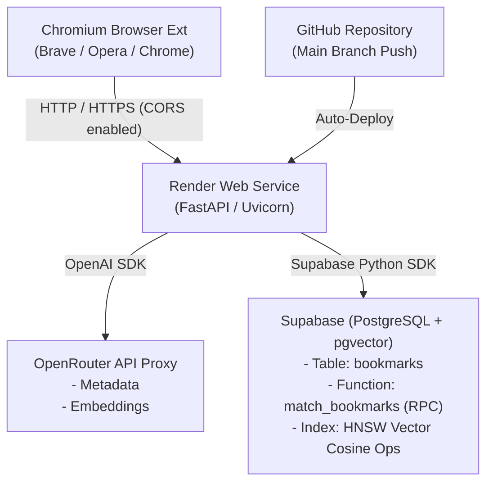

# AI Semantic Bookmark Manager

A full-stack, AI-powered bookmark manager and browser extension. Instead of relying solely on exact keyword matches, this system automatically scrapes web pages, extracts structured metadata via LLMs, generates 1536-dimensional vector embeddings, and performs semantic similarity searches powered by `pgvector`.

---

## Key Features

* **AI Metadata Extraction:** Automatically scrapes page content using BeautifulSoup and uses LLM models via OpenRouter to extract website titles, concise descriptions, broad categories, and tags in strict JSON.
* **Semantic Vector Search:** Embeds query strings using high-dimensional embedding models and executes cosine similarity searches in Postgres.
* **Instant URL Status Check:** Opening the browser popup automatically checks if the active tab is already bookmarked, displaying existing metadata with options to **Regenerate** or **Delete**.
* **Full Bookmark Management:** Filter bookmarks by search terms across title/description/tags/category, sort by date/title, set pagination limits, and delete entries.
* **Cross-Browser Chromium Extension:** Built on Manifest V3 using lightweight HTML/CSS/JS—works natively on Brave, Opera, Chrome, and Edge.

---

## System Architecture & Infrastructure

The project uses a modern serverless pipeline designed for speed, scalability, and zero hosting costs:



1. **GitHub ➔ Render Deployment Pipeline:** Render connects directly to the GitHub repository. Whenever code is pushed to the `main` branch, Render automatically triggers a deployment, builds the environment, and runs the FastAPI instance using `uvicorn`. Render also manages SSL/HTTPS termination automatically.
2. **OpenRouter API Integration:** Serves as a unified LLM proxy. We use `google/gemma-4-26b-a4b-it:free` for JSON metadata generation and `nvidia/nemotron-3-embed-1b:free` (normalized and sliced to 1536 dimensions) for vector embeddings.
3. **Supabase & `pgvector`:** Stores bookmark records alongside 1536-dimensional vector embeddings. Vector searches run directly inside Postgres via a custom SQL Remote Procedure Call (RPC) using HNSW (Hierarchical Navigable Small World) indexing for quick vector distance queries.

---

## Tech Stack

* **Backend:** Python 3.10+, FastAPI, Uvicorn, BeautifulSoup4, Requests, NumPy
* **Database & Vector Store:** Supabase (Postgres), `pgvector` extension, HNSW Index
* **AI & Embeddings:** OpenRouter API, OpenAI Python SDK
* **Frontend:** Web Extension Manifest V3 (Vanilla JS, HTML5, CSS3)
* **Hosting & CI/CD:** Render, GitHub

---

## Prerequisites

Before running or deploying the project, ensure you have:

* Python 3.10+ installed locally.
* A [Supabase](https://supabase.com/) project set up.
* An [OpenRouter](https://openrouter.ai/) API key.
* A [Render](https://render.com/) account (if deploying live).

---

## Setup & Installation

### 1. Database Setup (Supabase)

Navigate to your Supabase **SQL Editor** and run the following script:

```sql
-- 1. Enable the vector extension
CREATE EXTENSION IF NOT EXISTS vector;

-- 2. Create the bookmarks table
CREATE TABLE bookmarks (
    id UUID DEFAULT uuid_generate_v4() PRIMARY KEY,
    url TEXT NOT NULL UNIQUE,
    title TEXT,
    description TEXT,
    category TEXT,
    tags TEXT[],
    embedding vector(1536),
    created_at TIMESTAMP WITH TIME ZONE DEFAULT timezone('utc'::text, now())
);

-- 3. Create the cosine similarity search function
CREATE OR REPLACE FUNCTION match_bookmarks (
    query_embedding vector(1536),
    match_threshold FLOAT,
    match_count INT
)
RETURNS TABLE (
    id UUID,
    url TEXT,
    title TEXT,
    description TEXT,
    category TEXT,
    tags TEXT[],
    similarity FLOAT
)
LANGUAGE plpgsql
AS $$ BEGIN     RETURN QUERY     SELECT         bookmarks.id,         bookmarks.url,         bookmarks.title,         bookmarks.description,         bookmarks.category,         bookmarks.tags,         1 - (bookmarks.embedding <=> query_embedding) AS similarity     FROM bookmarks     WHERE 1 - (bookmarks.embedding <=> query_embedding) > match_threshold     ORDER BY bookmarks.embedding <=> query_embedding     LIMIT match_count; END; $$;

-- 4. Create HNSW index for fast vector searches
CREATE INDEX ON bookmarks USING hnsw (embedding vector_cosine_ops);

```

### 2. Backend Local Setup

1. **Clone the repository:**

```bash
git clone https://github.com/fraquilone/AI-Semantic-Bookmarks-Manager.git
cd "AI-Semantic-Bookmarks-Manager/Python Backend"
```

2. **Create and activate a virtual environment:**

```bash
python -m venv venv
source venv/bin/activate  # On Windows: venv\Scripts\activate
```

3. **Install dependencies:**

```bash
pip install -r requirements.txt
```

4. **Set Environment Variables:**

```bash
export SUPABASE_URL="https://your-supabase-project.supabase.co"
export SUPABASE_KEY="your-supabase-anon-key"
export OPENAI_API_KEY="your-openrouter-api-key"

# Uses the OpenAI SDK, but requires an OpenRouter key
```

5. **Start the local server:**

```bash
uvicorn main:app --reload
```

* The API will be running at http://127.0.0.1:8000

### 3. Deploying to Render
Create a new Web Service on Render and connect your GitHub repository.

* Set the runtime to Python 3.

* Set the Build Command: pip install -r requirements.txt

* Set the Start Command: uvicorn main:app --host 0.0.0.0 --port $PORT

* Add your Environment Variables in the Render Dashboard (SUPABASE_URL, SUPABASE_KEY, OPENAI_API_KEY).

### 4. Extension Setup (Brave / Opera / Chrome / Edge)

* Open extension/popup.js and set your live backend URL:

const API_BASE_URL = "https://YOUR-APP-NAME.onrender.com";

* Open your browser's extension page (brave://extensions or chrome://extensions).

* Enable Developer Mode (top-right toggle).

* Click Load Unpacked and select the extension folder containing manifest.json, popup.html, popup.css, and popup.js.

## Usage:
Click on the extension icon from the extensions tab on any page to use it.
There are three main tabs in the extension, Save, Search and Manage. The extension opens the 'Save' section by default. If a URL is already bookmarked, the extension will fetch the saved details and display them, along with options to regenerate the bookmark (if you are not satisfied with the AI description or tags generated) or delete it. If not already bookmarked, then you will see a 'Generate AI Bookmark' option. The 'Search' section allows you to search the database for URLs based on a description of the website. The 'Manage' section displays a list of bookmarks stored which can be used to search for bookmarks using the Title, URL, tags, or category. This section also provides features to display a specific number of bookmarks, sort them based on time of creation or in alphabetical order.

## License:
This project is open-source and available under the MIT License.

## Contributing:
Contributions, issues, and feature requests are welcome! Feel free to check the issues page or submit a pull request.
